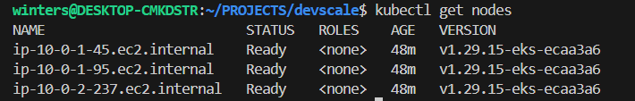
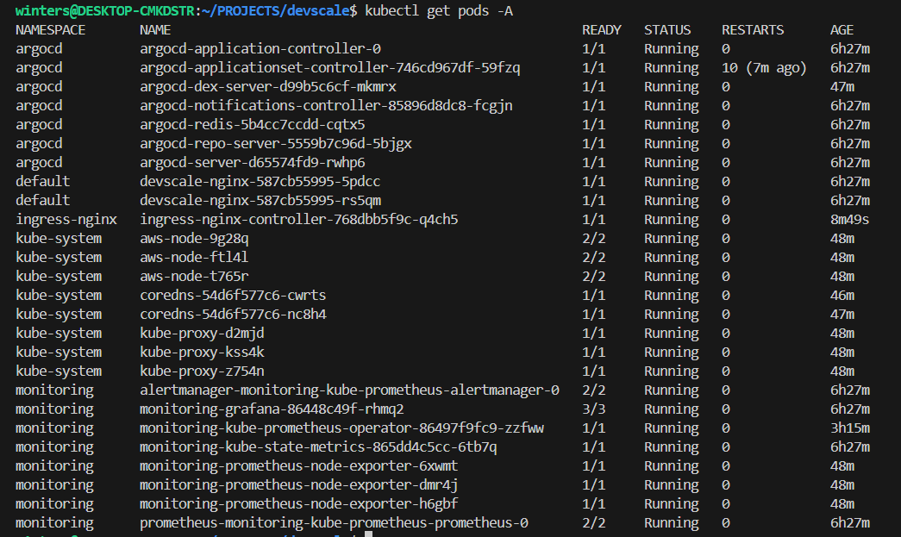
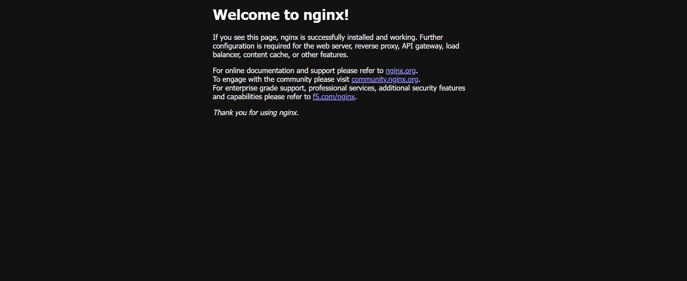

# DevScale Platform

DevScale is a production-style Kubernetes platform deployed on AWS using Infrastructure as Code, GitOps, and cloud-native observability.

The platform provisions infrastructure with Terraform, deploys workloads through ArgoCD GitOps, exposes services through an NGINX ingress controller, and provides monitoring with Prometheus and Grafana.

---

# Architecture

Terraform provisions AWS infrastructure including:

- VPC
- Networking
- Amazon EKS Cluster
- Worker Nodes

Applications are deployed into Kubernetes through GitOps using ArgoCD.

Monitoring is handled by Prometheus and visualized with Grafana dashboards.

External traffic enters the platform through an NGINX ingress controller backed by an AWS LoadBalancer.

Internet
↓
AWS LoadBalancer
↓
NGINX Ingress Controller
↓
Kubernetes Service
↓
Application Pods

---

# Technology Stack

Infrastructure  
- Terraform

Cloud Platform  
- AWS
- Amazon EKS

Container Orchestration  
- Kubernetes

GitOps  
- ArgoCD

Observability  
- Prometheus  
- Grafana

Networking  
- NGINX Ingress Controller

Application  
- NGINX

---

# Platform Components

The platform currently includes:

- EKS Kubernetes cluster
- Worker nodes
- ArgoCD GitOps controller
- Prometheus monitoring stack
- Grafana dashboards
- NGINX ingress controller
- Public LoadBalancer
- NGINX demo application

---

# Screenshots

## Kubernetes Cluster State

## Ingress Load Balancer

## Public Application Endpoint

---

# Deployment Flow

Terraform  
↓  
AWS Infrastructure  
↓  
EKS Cluster  
↓  
ArgoCD GitOps  
↓  
Application Deployment  
↓  
Prometheus Monitoring  
↓  
Grafana Dashboards  
↓  
Ingress Controller  
↓  
AWS LoadBalancer  
↓  
Public Internet

---

# Learning Outcomes

This project demonstrates:

- Infrastructure automation using Terraform
- Kubernetes cluster deployment on AWS
- GitOps continuous deployment with ArgoCD
- Production-style monitoring using Prometheus and Grafana
- Public traffic routing using Kubernetes ingress

---

# Future Improvements

- CI/CD pipeline integration
- Application container build automation
- Horizontal pod autoscaling
- Advanced observability dashboards
- Multi-service microservice deployment